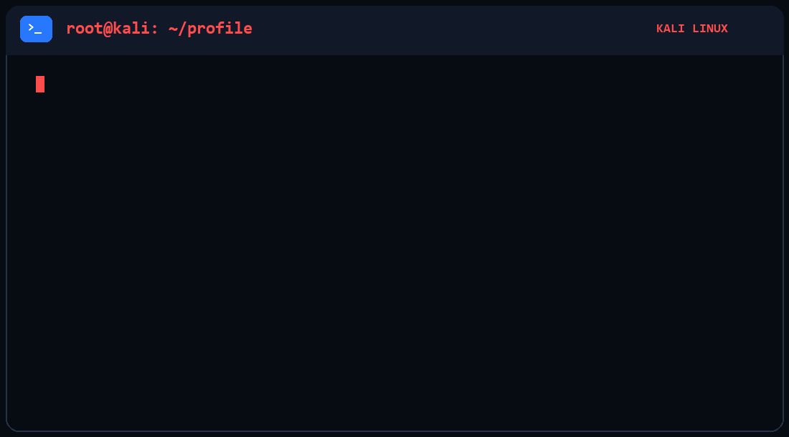

<!-- TOP KALI BLUE BANNER -->

  

<h1 align="center">Hi, I'm Dorian</h1>

  

<!-- ANIMATED KALI LINUX TERMINAL -->

  

---

<h2 align="center">Featured Projects</h2>

  
  

---

<h2 align="center">🛠️ Technologies & Tools</h2>

  

  

  

  

  

---

<h2 align="center">Cybersecurity Tools</h2>

     

---

<h2 align="center">GitHub Statistics</h2>

  
  

---

<h2 align="center">🤝 Check Out My Colleagues</h2>

  

  

---

<h2 align="center">🐍 My Contributions Snake</h2>

  

---

  <i>
    Building security tools, analyzing threats and strengthening defensive capabilities.
  </i>

  <b>Powered by Python, cybersecurity and coffee.</b>

<!-- BOTTOM KALI BLUE BANNER -->

  

